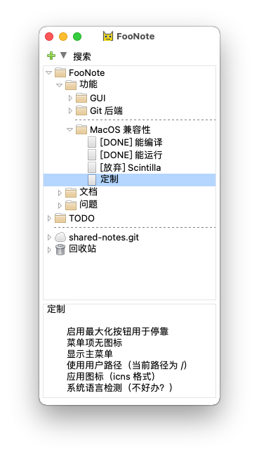

树形笔记伴侣。

类似于在纸质书的空白侧边栏。FooNote 在宽屏桌面划出侧边栏，用于学习或使用其他应用时做笔记。

主要功能
- 树形编辑：笔记成树形结构。支持多选、拖拽、复制粘贴。
- 侧边停靠：可于桌面侧边停靠。最大化窗口不会覆盖停靠区域。
- 数据同步：支持通过 Git 同步数据。
- 绿色小巧：压缩包和运行时内存占用仅若干 MB。无需安装即可使用。
- 自由软件：代码及文件格式开放。不存在私有格式套牢。

详细介绍见[使用手册](https://foonote.readthedocs.io/)。

Lightweight tree note taking companion.

Designed to be used as a complement to other "main" apps. For paper books, it's natural to take notes in the margins. FooNote provides such margins on the screen for notes of other apps.

Features
- Tree Structured: Notes are organized by a tree.
- Tree Editing: Support multi-selection, drag-drop, and copy-paste.
- Docking: Dock on the screen. Maximized windows won't overlap with the FooNote.
- Syncing: Support syncing via Git.
- Lightweight: Executable and runtime memory usage are just a few MBs.
- Portable: Do not need installation.
- Free Software: Source code and data format are open. No vendor lock-in.

----

感谢：
- Opera (<= 12, 后为 Vivaldi) 浏览器：提供了树形笔记的主要想法
- [BooguNote](https://github.com/boogunote/bn1)：提供了 Windows 下桌面停靠的参考实现
