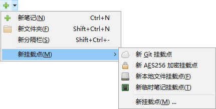
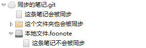
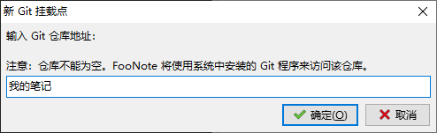
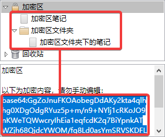
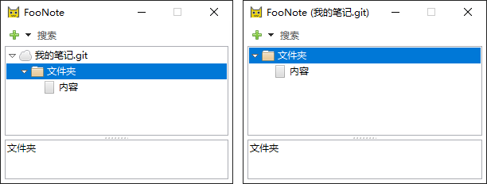

挂载点
=======

FooNote 笔记默认保存在本地磁盘上名为 ``Default.foonote`` 的文件中。

有时需要将笔记保存在其他文件，或者通过网络同步，或者对部分笔记进行加密，这时可以使用
“挂载点”功能。挂载点可以理解为特殊类型的文件夹，文件夹内的内容保存在其他地方。

挂载点可以从添加笔记的菜单中添加：

本地文件挂载点
--------------

本地文件挂载点允许将部分内容存储在其他 foonote 文件内。这带来一些灵活性：

如果有的笔记内容非常多，每次启动 FooNote 加载会拖慢速度，可以将它存放到单独的
foonote 文件挂载点，放到一个文件夹中：

  
这样打开 FooNote 后在不展开“文件夹”的情况下不会加载“大型笔记.foonote”。

有时想要在网络同步的笔记（使用 Git 挂载点）中存放一些不要同步的内容。这时也可以
在同步的挂载点下添加本地文件挂载点，存放不同步的笔记。

Git 挂载点
----------

Git 挂载点使用知名开源技术 Git_ 保存笔记。可通过网络增量同步，
也保存了笔记修改历史。

使用 Git 挂载点需要系统中已安装 Git，可从
`Git 官方网站 <http://git-scm.com/download>`_ 下载安装。

Git_ 支持本地和远程“仓库”（仓库可简单理解为“保存数据的地方”）。使用本地仓库可保存
笔记修改历史，也可将来同步到远程仓库中。使用远程仓库则方便在不同设备上同步笔记。

使用本地仓库
^^^^^^^^^^^^

添加 Git 挂载点，输入一个名字，比如“我的笔记”，即可创建本地 Git_ 仓库挂载点：

这会创建名为“我的笔记.git”的本地文件夹，内部是由 Git_ 管理的“仓库”。
可使用 Git_ 及其相关工具来查看其内容。

使用远程仓库
^^^^^^^^^^^^

远程仓库需要一个网络上的 Git 地址。市面上有一些免费的 Git 服务，主要用于软件开发者
之间的交流，但也可以用来提供 FooNote 的 Git 挂载点。有能力的用户也可以自建 Git
服务。

以下以 Gitee_ 为例，简要介绍如何在 FooNote 中使用远程仓库：

- 在 Gitee_ 创建私有仓库。
- 记住私有仓库的地址，如 ``https://gitee.com/alice/notes.git``。
- 在 FooNote 中添加 Git 挂载点，填入仓库地址，首次添加时可能需要输入用户密码。
- 完成！在该挂载点下的笔记会保存在 Gitee_ 上的仓库中。
- 在其他设备上挂载相同的仓库地址即可实现跨笔记同步。

AES256 加密挂载点
-----------------

加密挂载点提供一个区域，可存放一些只有正确输入密码才能查看的内容。

不同于本地文件和 Git 挂载点，加密挂载点不需要一个文件或网络地址来存储。它将密文存储
在一条笔记中。至于该笔记如何存储，交由其所处的挂载点处理。

加密挂载点可用于网络同步场景，比如，笔记使用远程 Git 挂载点同步，某些敏感内容也要
同步，但不想让远程 Git 服务商知道，这时就可以使用加密挂载点。

创建
^^^^

选择”新 AES256 加密挂载点“，输入密码后即可创建加密挂载点。创建后的加密挂载点处于
”解锁“状态，可进行编辑。

如下图，红色区域上下对应。上方为解密后的原文（广义”原文“，可包含多条笔记及文件夹），
下方为加密后的密文。解锁时会根据密文生成原文，保存时会根据原文生成密文。

不要手动编辑密文，会导致无法解密。

锁定
^^^^

从右键菜单（或者用 :kbd:`.` 键菜单）中选择“锁定”，即可关闭加密区解锁内容。
加密区内容重新锁定，需要重新输入密码才能查看：

.. warning::

    FooNote 采用的 AES256 加密算法为工业界信任且广泛采用的加密算法，没有已知缺陷。
    加密挂载点没有找回密码的功能，”锁定“或密码丢失后笔记内容无法恢复！
    FooNote 同时使用了 业界认可的 scrypt_ 密码派生函数，即便密码不长，暴力破解
    也有难度！

解锁
^^^^

双击加密笔记，或者选定后按下 :kbd:`Enter`，即可输入密码。
密码正确加密区将解锁并可进行编辑。

.. warning::

    若系统感染病毒，有键盘记录器之类的恶意软件，FooNote 的加密功能对此无抵御力。
    输入密码时需了解这一风险。

根节点
------

FooNote 笔记默认保存在本地磁盘上名为 ``Default.foonote`` 的文件中。

这里 ``Default.foonote`` 是一个用在”根节点“的本地文件挂载点。”根节点“是所有界面上
能见到的最上层的笔记、文件夹等的父节点。通过命令行参数，可以让 FooNote 使用其他挂载点
作为”根节点“。比如：

.. code-block::

    foonote 我的笔记.foonote
    foonote 我的笔记.git
    foonote https://gitee.com/alice/notes.git

指定”根节点“地址会显示在 FooNote 标题栏以示区分。指定根节点可以使笔记树看起来更简洁
一些。作为对比，左图显示了使用普通挂载点功能挂载”我的笔记.git“，右图显示使用
”我的笔记.git“作为根节点的情况：

”根节点“地址可以在”关于“对话框中查看。不同的根节点将会使用不同的前端配置文件，这样
窗口大小，停靠等设置可对不同的挂载点做定制。

.. _Git: https://git-scm.com/
.. _Gitee: https://gitee.com/
.. _scrypt: https://tools.ietf.org/html/rfc7914