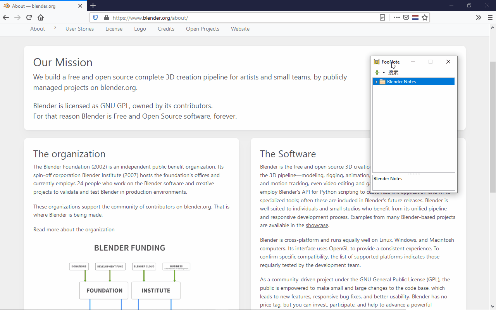

侧边停靠
========

FooNote 主界面可停靠于桌面一侧。适用于在同时使用其他“最大化窗口”的软件时做笔记。

在 Windows 下，只需要把 FooNote 拖动到屏幕边缘即可实现侧边停靠，停靠后其他最大化窗口不会
不会和覆盖 FooNote 停靠区域：

也可以通过标题栏菜单选择侧边停靠。拖动窗口时按住 :kbd:`Ctrl` 键可以防止侧边停靠。

在 macOS 下，可使用 `分屏浏览 <https://support.apple.com/zh-cn/HT204948>`_
功能实现侧边停靠。