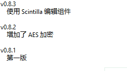
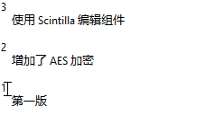
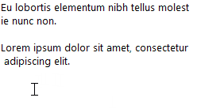

.. _TextEditor:

文本编辑区
==========

文本编辑区可编辑 :ref:`TreeView` 中选定的笔记节点内容。部分特殊笔记节点（如“回收站”和分隔栏）
不可编辑，选中后文本编辑区会是只读状态。

如果没有选中任何笔记（如， :ref:`TreeView` 为空），在文本编辑区中编辑会自动新建一条笔记。

基本的文本编辑的操作（移动光标、复制粘贴、通过 :kbd:`Shift` 选择文本等）不再赘述。
以下介绍一些在基本文本编辑软件（如“记事本”）中不存在的功能。
部分功能在一些高级的文本编辑软件中已经比较常见。

附加功能
--------

自动缩进
^^^^^^^^

按 :kbd:`Enter` 换行后，保留行首缩进。

缩进控制
^^^^^^^^

选定多行文本后，按 :kbd:`Tab` 和 :kbd:`Shift+Tab` 可以增加或减少缩进。

智能行首
^^^^^^^^

按 :kbd:`Home` 将光标移动到不包含空白字符的行首，再按一次移动到
包含空白字符的行首。

专注模式
^^^^^^^^

按下 :kbd:`F11` 或从树形笔记区右键菜单中选择“专注模式”，文本编辑区将“最大化”到
全 FooNote 界面，用于专注于某一笔记的编写。再按一次 :kbd:`F11` 或者 :kbd:`Esc`
可以退出“专注模式”。

.. _EditorScintilla:

Scintilla 附加功能
------------------

FooNote 文本编辑区支持使用 Scintilla_ 控件。启用后支持一些高级功能。
Scintilla_ 是一款知名文本编辑控件，在其他软件（如 Notepad++）中也有采用。

.. note::

   Scintilla 控件仅限 Windows 版，相比 Windows 原生文本编辑区功能有较大提升。
   但 macOS 文本编辑区本身已有多级撤销、彩色文字、文本拖放功能，还有一些如拼写检查、
   字典查询等功能，使用 Scintilla 后反而会丧失功能，故没有采用。

多级撤销
^^^^^^^^

撤销和重做可支持多级操作。

多重光标
^^^^^^^^

按住 :kbd:`Ctrl` 点击，或者按住 :kbd:`Alt` 竖着拖动可以产生多个光标。多个光标允许在多处
同时编辑文本。

文本拖放
^^^^^^^^

选定文本后可以拖放移动，也可以跨应用程序（如 FooNote ↔ Firefox / Word）拖放。

DirectWrite 渲染
^^^^^^^^^^^^^^^^^

在设置界面（按 :kbd:`Ctrl+Shift+P` 调出）有选项，可让 Scintilla_ 控件使用
DirectWrite 技术渲染文字。开启后可以显示彩色表情图标（Emoji，如🙈）。

.. list-table::

    * - .. image:: image/sciedit-gdi.png
      - .. image:: image/sciedit-directwrite.png
    * - GDI 文字渲染
      - DirectWrite 文字渲染

目前 FooNote 其他界面部分（树形笔记区和搜索栏）不支持 DirectWrite。
主要因为 Windows 标准控件库（``comctl32.dll``）长期未更新，没法方便采用新技术。

.. _Scintilla: https://www.scintilla.org/