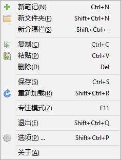

.. _Hotkeys:

快捷键
======

标准快捷键
^^^^^^^^^^

FooNote 主界面多处支持快捷键操作。菜单中有快捷键的说明，这些快捷键在主界面有效：

FooNote 支持标准图形界面控件的快捷键操作，这些快捷键在其他应用中类似界面也应该有效，例如：

* 使用 :kbd:`Tab` 和 :kbd:`Shift+Tab` 来切换焦点。
* 标准控件中，使用 :kbd:`方向键` 移动选择项，:kbd:`Shift+方向键` 多选。
* 树形控件中，使用 :kbd:`→` 展开文件夹，:kbd:`←` 收缩文件夹。
* 菜单中有字母下划线，就能使用单字母键选中菜单项。例如在上图菜单中，按下 :kbd:`A` 就相当于点击了“关于”。
* 按钮中有下划线，使用 :kbd:`Alt+字母` 来选中按钮。
* 对话框中 :kbd:`Esc` 用于“取消”，:kbd:`Enter` 有时能用于“确定”。

额外快捷键
^^^^^^^^^^

除此之外，FooNote 主界面还支持一些其他的快捷键：

* :kbd:`Ctrl+/`：在空白文件夹和笔记之间切换。如果新增了普通笔记，后来想要改变成文件夹
  可以用这个快捷键。

处于搜索栏时：

* :kbd:`Enter` 或 :kbd:`↓`：切换到搜索结果列表，或树形笔记区（如果搜索文字为空）。
* :kbd:`Esc`：清空搜索文字。

处于树形笔记区或搜索结果列表时：

* :kbd:`Enter`：切换到笔记文本编辑区，或弹出解密对话框（如果选定内容已加密且未解密）。
* :kbd:`Esc` 或 :kbd:`/`：切换到搜索栏。
* :kbd:`.`： 弹出菜单。

处于笔记文本编辑区时：

* :kbd:`Esc`：切换到树形笔记区，或者退出“专注模式”（如果正处于“专注模式”）。