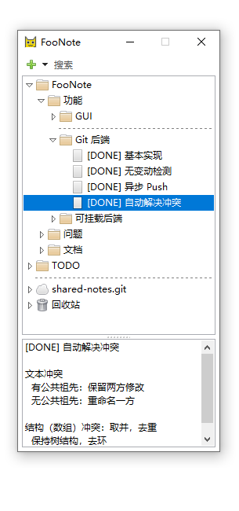
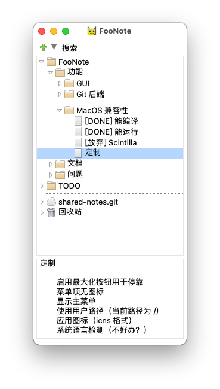

.. FooNote documentation master file, created by sphinx-quickstart.

FooNote v0.8.3 用户手册
==========================

FooNote 是一款桌面树形笔记软件。不同于某些重量级功能复杂的笔记软件单品，
FooNote 轻量、占屏窄，适用于配合其他各种应用使用做辅助笔记。

同时，FooNote 是免费开源软件。支持通过开源技术 Git_ 来同步、备份笔记及其修改历史，
笔记文件格式简单开放，没有某些私有云商用笔记软件的问题（例如，云服务关闭了怎么办？
笔记内容有没有其他软件能兼容读取？）。

FooNote 主界面如下：

笔记呈树形结构，下方的文本框用来编辑选定的笔记。点击下面的主题了解详细内容：

.. toctree::
   :maxdepth: 1
   
   tree
   editor
   dock
   backend
   hotkey
   changelog
   devguide

.. _Git: https://git-scm.com/