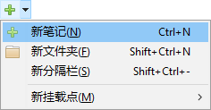
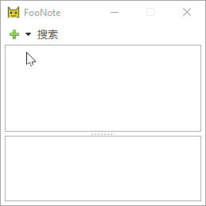
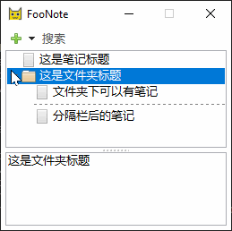
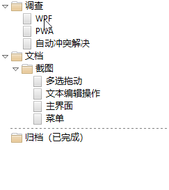
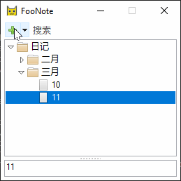

.. _TreeView:

树形笔记区
==========

树形笔记区显示了笔记树结构，可新建笔记、展开折叠、以及选定笔记在
:ref:`TextEditor` 编辑。

基本操作
--------

新建及编辑笔记
^^^^^^^^^^^^^^

使用添加笔记（加号）菜单，或者对应的快捷键（如 :kbd:`Ctrl+N`），在树形笔记区添加笔记、
文件夹和分隔栏：

选定的笔记或文件夹可以在下方的文本编辑区编辑具体内容，编辑区的第一行标题将显示在树形笔记区。

以下动画演示了如何添加笔记、文件夹、分隔栏以及编辑笔记的内容：

回收站
^^^^^^

从右键菜单中可以将笔记或文件夹删除。笔记第一次被删除时将进入“回收站”，还能再找回：

从回收站再次删除笔记将无法简单找回。

以上，涵盖了 FooNote 的基本操作，日常使用可能已经够用。

其他功能
--------

FooNote 的树形笔记区支持一些其他的实用功能，使得编辑树形笔记更方便。

多选、拖放及复制粘贴
^^^^^^^^^^^^^^^^^^^^

树形笔记区支持使用 :kbd:`Ctrl` 和 :kbd:`Shift` 多选。选中后可以拖放移动：

通过右键菜单或者快捷键可以对选中项进行复制和粘贴。被复制的内容也可以粘贴到其他文本编辑软件中，
但是树形结构不再保持，只粘贴文本内容。

标题序列推测
^^^^^^^^^^^^

新建笔记或文件夹时，FooNote 会根据之前的笔记标题推测出新笔记可能的标题。例如在之前标题是
“10”，“11” 的情况下，推测新标题是 “12”；在已知之前标题为“二月”、“三月”，
推测新标题是“四月”：

.. _Git: https://git-scm.com/